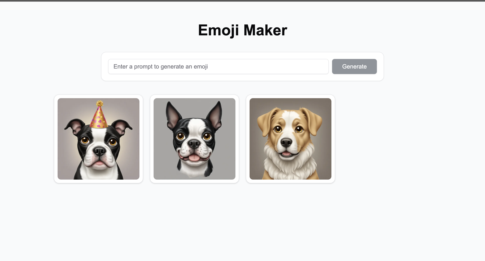

# Emoji Maker
by Jonathan Sher

An AI-powered emoji generator built with Next.js and Replicate's SDXL model. Create custom, high-quality emojis from text descriptions.

## Features

- Generate custom emojis using natural language prompts
- Download generated emojis
- Like/favorite your generated emojis
- Responsive grid layout
- Modern UI with Geist font and Shadcn components

## Getting Started

1. Clone the repository:
```bash
git clone https://github.com/your-username/emoji-maker.git
cd emoji-maker
```

2. Install dependencies:
```bash
npm install
```

3. Set up environment variables:
- Copy `.env.example` to `.env.local`
- Add your Replicate API key to `.env.local`:
```
REPLICATE_API_TOKEN=your_replicate_api_token_here
```

4. Run the development server:
```bash
npm run dev
```

Open [http://localhost:3000](http://localhost:3000) with your browser to see the application.

## Technologies Used

- [Next.js 14](https://nextjs.org/) - React framework
- [Replicate](https://replicate.com/) - AI model hosting
- [Shadcn UI](https://ui.shadcn.com/) - UI components
- [Tailwind CSS](https://tailwindcss.com/) - Styling
- [Geist Font](https://vercel.com/font) - Typography
- [Lucide Icons](https://lucide.dev/) - Icons

## Project Structure

- `/app` - Next.js app router pages and API routes
- `/components` - React components
- `/public` - Static assets
- `/lib` - Utility functions and shared code

## Environment Variables

- `REPLICATE_API_TOKEN` - Your Replicate API token (required)

## Contributing

Contributions are welcome! Please feel free to submit a Pull Request.

## License

This project is licensed under the MIT License - see the LICENSE file for details.

## Example


*Example of generated dog emojis using the application*

## Acknowledgments

- [Replicate](https://replicate.com/) for hosting the SDXL emoji model
- [Vercel](https://vercel.com/) for Next.js and deployment platform
- [Shadcn](https://ui.shadcn.com/) for beautiful UI components
